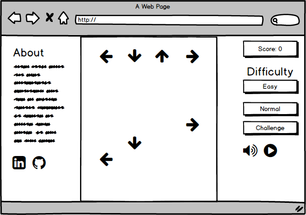

## Keyboard Dance Dance Revolution Game

### Background

Dance Dance Revolution (DDR) is a full-body video game where players, standing on a dance pad with four arrows, step in time with the arrows that scroll across a screen.  The arrows follow the beat of the music at varying levels of difficulty.

This keyboard DDR game will embrace the spirit of the original DDR game, but instead of stepping around on a dance pad to match the arrow directions, players will tap the arrows on a keyboard with their fingers.

### Functionality & MVP  

Players will be able to:

* start and pause the game
* choose a level of difficulty
* a score display
* use the keyboard to input valid moves to receive points

In addition, this project will include:

* An About section describing the background and rules of the game
* A production Readme

### Wireframes

The game will consist of a single screen through which the arrows will scroll vertically.  The About section on the left will describe how to play the game, and a game options menu will be on the right.  Game options will include a level of difficulty, sound options, and a start/pause option.

### Architecture and Technologies

- Vanilla JavaScript and `jquery` for overall structure and game logic,
- `Easel.js` with `HTML5 Canvas` for DOM manipulation and rendering,
- Webpack to bundle and serve up the various scripts.

In addition to the webpack entry file, there will be three scripts involved in this project:

`game.js`: this script will handle the logic for creating and updating the necessary `Easel.js` elements and rendering them to the DOM.

`arrow.js`: this script will handle the constructor and functions for the arrow objects.

`matches.js`: this script will handle the logic for when the player's keystrokes match the arrows rendered.

### Implementation Timeline

**Day 1**: Setup all necessary Node modules, including getting webpack up and running and `Easel.js` installed.  Create `webpack.config.js` as well as `package.json`.  Write a basic entry file and the bare bones of all 3 scripts outlined above.  Learn the basics of `Easel.js`.  Goals for the day:

- Get a green bundle with `webpack`
- Learn enough `Easel.js` to render an object to the `Canvas` element

**Day 2**: Dedicate this day to learning the `Easel.js` API.  First, build out the `Arrow` object to connect to the `Game` object.  Then, use `game.js` to create and render the basic game display.

- Complete the `arrow.js` module (constructor, update functions)
- Render a arrows to the `Canvas` using `Easel.js`

**Day 3**: Implement the logic of matching arrows to the player's keystrokes

- Able to match arrows with arrows rendered on screen and give player feedback on a hit or miss
- create timed arrow scripts to match a song

**Day 4**: Install the controls for the user to interact with the game.  Style the frontend, making it polished and professional.  Goals for the day:

- start and pause buttons
- sound on and off button
- Have a styled `Canvas`, nice looking controls and title

### Bonus features

There are many directions this cellular automata engine could eventually go.  Some anticipated updates are:

- varying difficulty levels of play
